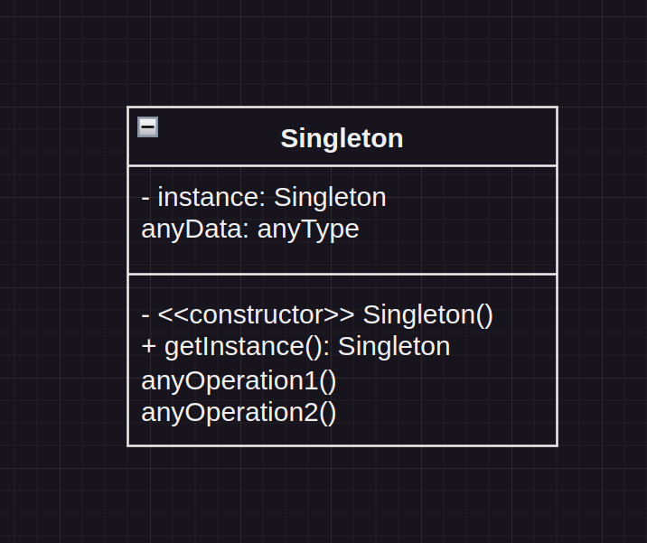

# Singleton

## Intenção oficial 
> Garantir que uma classe tenha somente uma instância no programa e fornecer um ponto de acesso global para a mesma.

## Explicação 
* Geralmente usado para acesso a **recursos compartilhados**, como acesso à base de dados, interfaces gráficas, sistema de arquivos, servidores de impressão, logger, e mais.

* Também usado para substituir variáveis globais, como em casos de uso de **objetos de configuração do sistema** como um todo.

>[!TIP]
> Um exemplo prático de uso de singleton está relacionado aos **arquivos de configuração**, em que é exportado um objeto reutilizável para toda a aplicação, como o arquivo de configuração de banco de dados.


* Pode-se permitir acesso global ao Singleton em toda a aplicação, assim como fazemos com as **_variáveis globais_**.

* Comparado às variáveis globais, a vantagem do Singleton é que podemos **proteger a instância com _encapsulamento_**, evitando que outro código sobrescreva seu valor.

## Estrutura



### Observações

* Temos uma instância privada da classe, sendo primordial para o funcionamento do Singleton.

>[!IMPORTANT] 
> Essa instância, por sua vez, deve ser **_estática_**, pois previne que sejam criadas novas instâncias que possam sobrescrevê-la.

* Temos um método construtor privado, que previne, novamente, que haja novas instâncias de classe.

* Temos um **getter** para a instância, onde decidimos se criamos uma nova instância, ou retornamos a instância já criada.

## Implementação

```typescript
export class Singleton {
    private static _instance: Singleton | null = null; //Instância

    private constructor() { //Método construtor
        // Impossibilita a criação de novas instâncias
    }

    static get instance(): Singleton { //Getter
        //Verifica se é a primeira vez que estamos instanciando.
        if (Singleton._instance === null) {
            //Caso seja a primeira vez, o singleton é instanciado novamente para armazenar informações importantes ao objeto.
            Singleton._instance = new Singleton();
        }

        //Retorna a instância singleton.
        return Singleton._instance;
    }
}
```


## Aplicabilidade
* Use o singleton quando uma classe precisa ter somente **_uma_** instância disponível em todo o seu programa.

* Use o singleton quando perceber que está usando **_variáveis globais para manter partes importantes do programa_**, como variáveis de configuração, usadas por toda a aplicação.

## Consequências - Prós e Contras do Singleton

### Benefícios
* Acesso controlado à instância única.
* É fácil permitir um número maior de instâncias, caso mude de ideia.
* Usa o Lazy Instantiation, o Singleton só é criado no momento do uso.
* Substitui variáveis globais.

### Malefícios
* É mais difícil de testar, pois a instância é única na aplicação.
* Viola o princípio da responsabilidade única.
* Requer **tratamento especial** em casos de concorrência (isto é, duas partes do programa instanciando o singleton ao mesmo tempo).
* (Curiosidade) O autor descreveu que este seria o único padrão que ele removeria se fosse "refatorar" o livro" - [Fonte: Infomit](https://www.informit.com/articles/article.aspx?p=1404056)