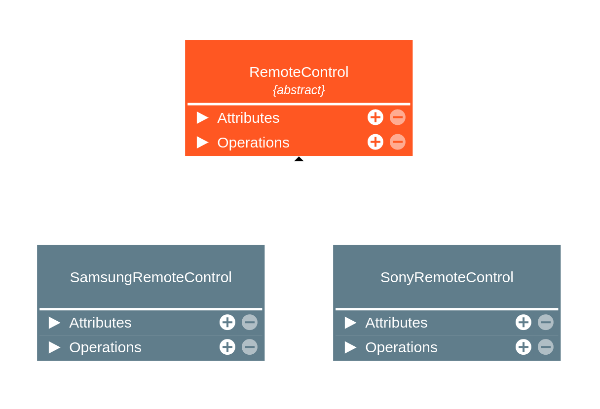
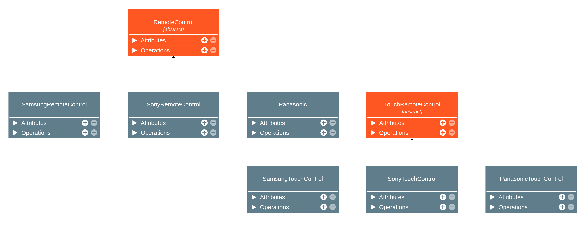
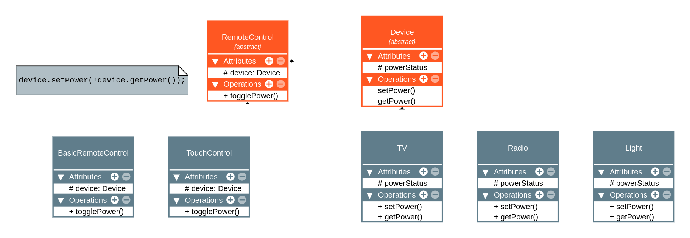

# Bridge 

## Intenção Oficial
> [!NOTE]
> Bridge é um padrão de projeto estrutural que tem a intenção de desacoplar uma abstração de sua implementação, de modo que as duas possam variar e evoluir independentemente.

## Abstração vs. Implementação
* **Abstração** é um código de alto nível que geralmente delega ações para outro objeto.
* **Implementação** é o código que realmente executa uma tarefa, faz um trabalho.

## Problema
 

A principal problemática em relação ao código acima é que, a partir do momento que quisermos implementar alguma modificação em `RemoteControl`, naturalmente criaríamos uma *outra classe abstrata*, gerando **duplicação de código**. Observe a imagem abaixo:

O padrão Bridge, portanto, veio para solucionar esse tipo de problema, utilizando **composição em vez de herança**:

### Observações
* A estrutura acima é dividida em **duas partes principais**, como descrito pela GoF: **abstração**, responsável por delegar tarefas para o restante do código e a **implementação**, responsável por executar tais tarefas delegadas.

## Diferenças entre `Bridge` e `Adapter`

> (GOF, página 208) *A diferença chave entre esses padrões está nas suas **intenções**... O padrão *Adapter* faz as coisas funcionarem APÓS elas terem sido projetadas. O *Bridge* as faz funcionar ANTES QUE *existam*...

## Aplicabilidade
Use o padrão Bridge quando:
* Soubermos que a estrutura do código terá **abstrações** (código de alto nível) e implementações dessa abstração (detalhes) que **possam variar de maneira independente**.
* Soubermos que o Adapter poderia ser aplicado naquela estrutura.
* Quisermos dividir uma **classe que possa ter diversas variantes** (como em produtos e suas variações de cores).
* Quisermos trocar as implementações em tempo de execução.

## Consequências
**Bom**
1. Desacopla o código da abstração do código da implementação (SRP).
2. Implementa o OCP ao permitir novas implementações e/ou implementações para código existente.
3. Tem as mesmas vantagens do Adapter.

**Ruim** 
1. Aumenta a complexidade da aplicação quando implementado em locais incorretos.