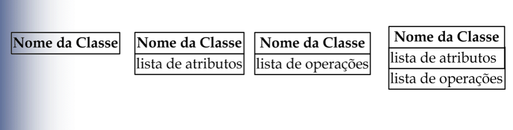

# UML Básico - uma revisão de Engenharia de Software (básica)

## Introdução - O que é UML e sua relação com a Engenharia de Software

>[!NOTE] 
> UML, ou Unified Modeling Language, é uma linguagem de notação utilizada para modelar e documentar as fases de desenvolvimento de softwares orientados a objetos, podendo auxiliar na construção, especificação e visualização de um diagrama.

A UML tem papel crucial na Engenharia de Software, visto que a UML procura fornecer meios para auxiliar no levantamento de requisitos que irão consituir um sistema.

Sabendo-se disso, torna-se indispenśável a revisão de conceitos vindos da Engenharia de Software, amplamente utilizados nos diagramas da UML.

## Tabela de conceitos
1. Classes
2. Relações
3. Interfaces
4. Classes Abstratas

## Classes
### O que é uma classe?
>[!IMPORTANT]
> Uma classe representa um grupo de objetos semelhantes, descrevendo-os através de atributos e operações.

* Os atributos de uma classe são características, informações que um objeto armazena.
* As operações correspondem às ações que um objeto sabe realizar.

### Notação UML
É representada através de uma "caixa" com no máximo três compartimentos exibidos. Sua notação depende do nível de abstração desejado.

## Relações 
>[!IMPORTANT]
> Classes podem se relacionar entre si. Na UML, existem seis tipos de relações entre classes, são elas: associação, agregação, composição, dependência, generalização, realização.

### Associação
Relação estrutural que descreve um conjunto de ligações, estas sendo uma conexão entre objetos. 

#### Exemplos
* Pessoa possui CPF
* Empresa contrata funcionários
* Professor leciona alunos.

### Generalização
Um elemento especializado (que aponta) é mais específico que o elemento generalizado (que é apontado).

#### Exemplos
* Estudante é uma pessoa
* Carro é um veículo
* Computador é um dispositivo eletrônico

### Realização
Um elemento garante realizar (concluir, completar) o que é esperado pelo outro elemento. São encontradas principalmente entre interfaces e as classes ou componentes que a realizam.

#### Exemplos
* Classe Cachorro implementando a ação de fazer barulho da interface IAnimal.
* Classe Aluno implementando a ação de estudar da interface Estudante.

### Agregação e Composição
Agregação e composição são relacionamentos similares, porém diferentes quanto à existência dos objetos. Trata-se de casos especiais de tipos de associação entre classes. 

* **Agregação**: é uma associação que _agrega valor ao objeto relacionado_ , é a relação que nos permite enxergar a relação entre os objetos como Todo/Parte.

* **Composição**: quando falamos de composição, dizemos que a relação entre objetos é Parte/Todo, o que nos permite inferir que a _parte não existe sem o todo_, isto é, uma classe está contida na outra.

#### Exemplos - Agregação

* Um carro possui 4 rodas.
* Uma pessoa possui duas mãos.
* Um celular possui aplicativos instalados.

#### Exemplos - Composição

* Um carro é **composto por** 4 rodas.
* Aplicativos **são instalados** em um celular.
* Uma casa é **composta por** 2 quartos.

## Interfaces

>[!NOTE]
> Uma interface pode ser considerada como uma **Entidade** que não possui implementação, apenas assinatura, isto é, apenas a definição de seus métodos sem o corpo (denominamos esses métodos de abstratos).

* Além disso, **todos os métodos de uma interface são _públicos e abstratos_**.

As interfaces, no código, funcionam como um tipo de "contrato", onde são especificados os atributos, métodos e funções que as classes que implementam essa interface são obrigadas a implementar.

## Classes Abstratas

>[!NOTE]
> As classes abstratas são similares às interfaces. Entretanto, possui algumas particularidades, quando comparadas às classes comuns.

* Uma classe abstrata **_não_ pode ser instanciada**.
* Uma classe abstrata deve possuir _pelo menos_ **um método abstrato**.
* É usada apenas para **ser herdada**, funcionando como uma super-classe.