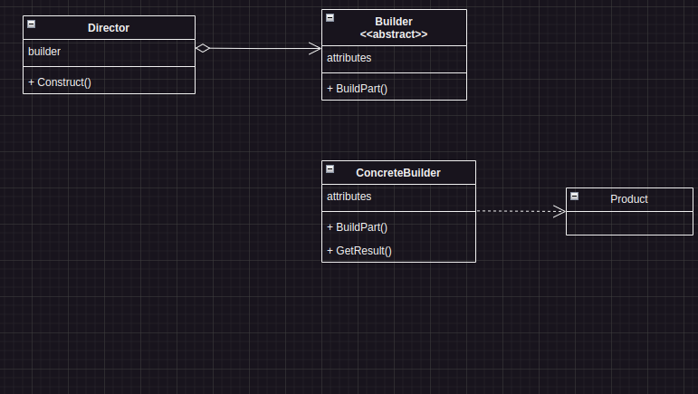

# Builder

## Intenção oficial 
> Separar a construção de um objeto complexo da sua representação de modo que o mesmo processo de construção possa criar diferentes representações.

## Explicação 
* O padrão sugere a **_separação do código_** que cria e o código que usa o objeto.

* Trata da criação de objetos complexos
    * Construtores muito complexos
    * Composição de vários objetos (composite)
    * Algoritmo de criação do objeto complexo

* Permite a criação de um objeto em etapas
* Permite method chaining
* O objeto final pode **variar** de acordo com a necessidade
* É um padrão complexo

## Estrutura


* **_Builder_**: Define o contrato (classe abstrata ou interface) de todos os objetos "Builder". As etapas de construção em comum são definidas aqui.
* **_ConcreteBuilder_**: Builders concretos implementam a interface de acordo com sua necessidade. Elas podem produzir produtos de _tipos_ diferentes.

>[!NOTE]
>Concrete Builder é uma classe **concreta**, isto é, uma classe que adota o comportamento da classe abstrata!

* **_Product_**: Os produtos finais são os objetos que o cliente deseja consumir. Eles não têm uma interface em comum pois podem ser de tipos diferentes.

* **_Director_**: A classe Director é opcional. Pode definir a _ordem_ em que as etapas de construção dos objetos são executadas.

## Exemplo de Builder (Simples)

```typescript
/* Em vez de: 
    export class Person {
        
        constructor(public name?: string, public age?: number) {

        }
        }
*/     
    export class PersonBuilder {
        //Atributo privado que instancia a classe principal
        private person = new Person();

        // Método que instancia um novo objeto, que resetará os atributos previamente preenchidos
        newPerson(): void {
            this.persion = new Person();
        }
        // Método setter, utilizando conceitos de method chaining (exemplificado adiante)
        setName(name: string): this {
            this.person.name = name;
        }
        // Método setter, utilizando conceitos de method chaining (exemplificado adiante)
        setAge(age: number): this {
            this.person.age = age;
            return this;
        }
        // Retorna o objeto criado.
        getResult(): Person {
            return this.person;
        }
    }

    // Exemplo de uso
    const personBuilder = new PersonBuilder();
    const person1 = personBuilder.setName('Henrique').setAge(20).getResult(); //Exemplo de method chaining (encadeamento de métodos)
    personBuilder.newPerson(); // Reseta a pessoa.
```

## Prós e Contras

### Prós
* Separa a _criação_ da _utilização_
* O cliente _não precisa_ criar objetos diretamente
* O mesmo código pode construir objetos diferentes
* Ajuda na aplicação de SRP e OCP.

### Contras
* O código final pode se tornar muito complexo.