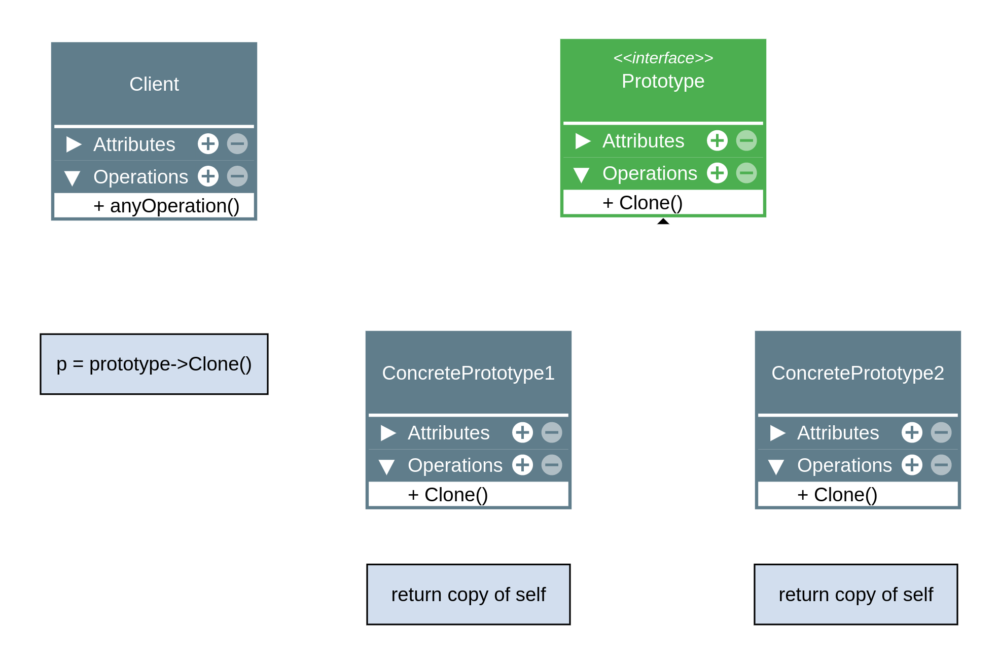

# Prototype 

## Intenção Oficial
> [!NOTE]
> Especificar os tipos de objetos a serem criados usando uma instância-protótipo e criar novos objetos pela cópia desse código.

## Sobre JavaScript e TypeScript
* São linguagens baseadas em protótipos.
* Objetos estão diretamente ligados a outros objetos.
* Pode-se literalmente fazer um objeto "herdar" de outro.
* A "herança" é obtida via **delegação** (um objeto delega algo para seu protótipo).
* Uma das maneiras mais simples para manipular o protótipo de um objeto é usando Object.create(prototypeObject).
* Também temos o costume de usar classes ou funções construtoras para manipulação de protótipos (isso faz com que JS/TS pareçam estar usando o padrão orientado a objetos clássico).

## Visão geral do padrão Prototype
* O tipo de objeto a ser criado é determinado pelo objeto protótipo.
* É tipicamente usado para evitar a recriação de objetos "caros" (complexos).
* Ajuda a evitar a explosão de subclasses.
* Pode manter (ou não) um registro de objetos protótipo em um objeto separado.
* Geralmente é criado apenas com um método "clone" dentro do objeto protótipo.
* O método clone pode gerar uma "shallow" ou "deeṕ" copy do objeto protótipo.
* Evita que o cliente conheça as classes que criam os objetos.

## Estrutura do Prototype




### Observações
* O código cliente é o código fora da estrutura do Prototype. É o seu código que deseja clonar o objeto protótipo.
* Existe uma interface apenas para garantir que todos os objetos protótipo têm o método "clone".

## Exemplo de código

```typescript
    interface Prototype {
        clone(): Prototype;
    }

    class Person implements Prototype {
        constructor(public name: string, public age: number) {}

        clone(): this {
            /* Obs: isso não é um clone, estamos apenas criando um novo objeto que tem este objeto como protótipo */
            const newPerson = Object.create(this);
            return newPerson;
        }
    }

    const person1 = new Person ('Henrique', 20);
    const person2 = person1.clone();

    console.log(person1.name);
    console.log(person2.name);

    console.log(person1 === Object.getPrototypeOf(person2));
```

## Aplicabilidade
* Use o padrão prototype quando precisar que seu código *não dependa* de classes concretas para a criação de novos objetos.
* Use o padrão prototype quando quiser evitar explosão de subclasses para objetos muito similares.
* Use o padrçai prototype para evitar a criação de objetos "caros".

## Consequências - Prós e Contras

### Prós
* Oculta classes concretas do código cliente.
* Ajuda na criação de objetos caros ou complexos.
* Evita a explosão de subclasses.

### Contras
* Clonar objetos que têm referências para outros objetos pode ser super complexo.

