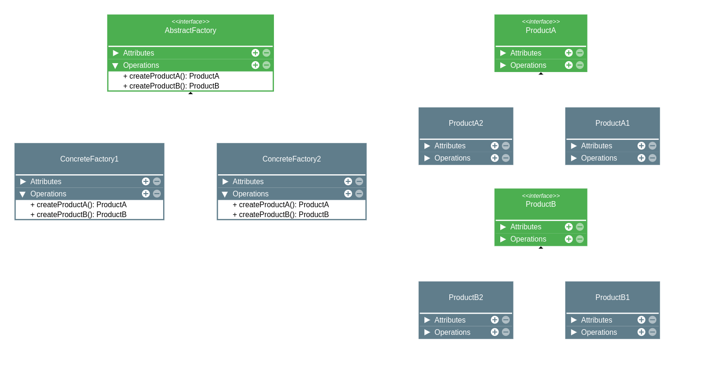

# Abstract Factory

## Intenção Oficial

> [!NOTE]
> Fornecer uma interface para criação de famílias de objetos relacionados ou dependentes, sem especificar suas classes concretas.

## Sobre o Abstract Factory

- É um padrão de criação, portanto lida com a **criação de objetos**.
- É uma fábrica, assim como o Factory Method.
- Geralmente é composto por múltiplos Factory Methods.

* Visa agrupar famílias de grupos compatíveis, criando uma fábrica concreta por um grupo de objetos compatíveis.
* Separa o código responsável pela criação do código, do qual é utilizado (SRP).
* Permite fácil implementação de novas famílias de objetos (OCP).
* Toda programação fica focada nas interfaces, e não em implementações.

## Estrutura

### Observações

- Esse padrão de projeto é útil para separar duas ou mais categorias, cuja lógica e implementação se concentra majoritariamente em interfaces.
- Cada categoria representa um método na interface abstract factory.
- Os objetos criados pelas classes concretas podem se relacionar entre si.

## Aplicabilidade

### Use o Absttract Factory quando:
* Um sistema deve ser independente de como seus produtos são criados, compostos ou representados.
* Um sistema deve ser configurado como uma família de produtos que podem (ou não) trabalhar juntos.
* Uma família de objetos for projetada para ser usada em conjunto e precisa-se garantir essa restrição.
* queremos fornecer uma biblioteca de classes de produtos e quer revelar somente suas interfaces, não suas implementações.

## Consequências - Prós e Contras
 
### Prós
* Os produtos serão sempre compatíveis entre si.
* Aplicação clara do Open/Closed Principle, tornando-se fácil adicionar novas fábricas e produtos.
* Aplicação clara do Single Responsibility Principle, o código que cria está separado do código que usa os objetos.

### Contras
* Muitas classes e maior complexidade de código a ser introduzido.