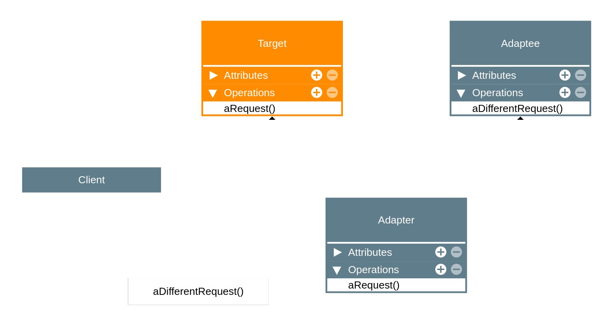

# Adapter

## Intenção Oficial
> [!NOTE]
> Converter a interface de uma classe em outra interface esperada pelos clientes. O Adapter permite que certas classes trabalhem em conjunto, pois de outra forma seria impossível, devido à incompatibilidade de suas interfaces.

## Sobre o Adapter
* É um padrão da categoria estrutural (structural)
* Faz exatamente o que um adaptador da vida real faz (pense em um adaptador de tomadas de um formato para outro)
* É muito usado para definir limites dentro de camadas da aplicaçã.
* Também pode ser usado para adaptar interfaces de código legado para um novo código.

## Estrutura por composição

### Observações
* O código cliente deve depender de uma interface, que servirá como um protocolo que será implementado pela classe concreta.

* O `Adapter` (classe concreta) é a única classe que precisará ser modificada com o tempo.

* O `Adaptee` é a classe agregada que funciona como o código externo ou legado.

## Estrutura por herança múltipla

### Observações
* O código cliente dependerá exclusivamente da interface novamente, que agora será uma classe-irmã da classe `Adaptee`

* O `Adapter` herda o método do protocolo e este, por sua vez, deverá usar o método de `Adaptee`

## Aplicabilidade

Utilize o padrão `Adapter` quando:

* Não queremos que o código dependa diretamente de código de terceiros ou legado
* Queremos usar uma classe existente, mas o protocolo criado no domínio seja é incompatível com a interface que o código ou domínio precisa.
* Queremos reutilizar várias subclasses que não possuam determinada funcionalidade, mas for impraticável estender o código de cada uma apenas para adicionar a funcionalidade desejada (mesma funcionalidade do decorator).

## Consequências

### Bom
* Desacopla o código da aplicação de códigos de terceitos
* Aplica o SRP ao separar a conversão de interfaces da lógica da aplicação
* Aplica o OCP ao permitir introduzir novos adapters para o código existente

### Ruim
* Aumenta a complexidade da aplicação (Por outro lado, qual outra solução deveria ser aplicada?)